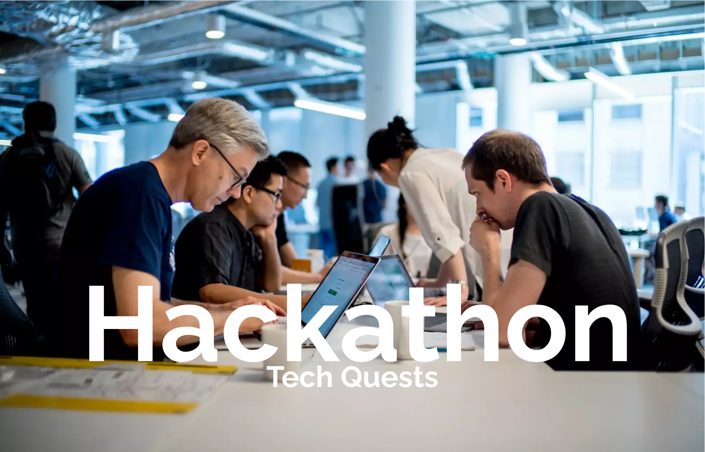

&nbsp;

<h1>About Our Skill Finding Program: Fostering Inclusive Innovation</h1>

Welcome to our Skill Finding Program! We strongly believe in the power of inclusivity and diversity to drive innovation and create impactful solutions. Our Skill Finding Program is designed to ensure that everyone feels welcome and empowered to participate, regardless of their skill level, background, or experience.

**Why Emphasize Inclusivity?**

Inclusivity is at the heart of our mission. We recognize that the most groundbreaking ideas emerge when individuals from different walks of life come together, bringing unique perspectives and skills to the table. By fostering an inclusive environment, we aim to break barriers and create opportunities for all participants to collaborate, learn, and grow during this exciting event.

**All Skill Levels Are Welcome:**

Whether you're a seasoned coding expert or a novice just starting your programming journey, our Skill Finding Program is tailored to accommodate participants of all skill levels. We celebrate diversity in expertise and encourage the formation of well-rounded teams that can leverage a wide range of talents.

**Bringing People Together:**

Our Skill Finding Program is more than just a team formation process; it's a chance for you to connect with like-minded individuals who share your passion for technology and creativity. We provide a dedicated platform where participants can introduce themselves, highlight their skills, and find teammates with complementary abilities.

**Promoting Collaboration:**

Inclusivity and collaboration go hand in hand. Through our Skill Finding Program, we aim to foster an atmosphere of cooperation and support, where participants can freely exchange ideas, offer assistance, and work together harmoniously to tackle challenges and achieve their project goals.

Join us in embracing the spirit of inclusivity and diversity as we embark on this thrilling hackathon journey. Together, we can create an environment where every participant can shine, learn, and make a meaningful impact. Let's build something incredible together!

## Hackathon Goals:

1. **Skill Demonstration:** Tech Quest' hackathons offer participants the chance to demonstrate their skills beyond just coding. Students can showcase their problem-solving abilities, creativity, critical thinking, teamwork, and domain-specific knowledge.

2. **Industry Connection:** We believe in providing valuable networking opportunities for students. Our hackathons will connect participants with industry professionals, mentors, and recruiters from leading companies, fostering meaningful relationships.

3. **Career Opportunities:** The ultimate goal is to unlock exciting career opportunities for students. Through this platform, participants will have a chance to impress potential employers and open doors to internships or full-time positions in leading software and non-software companies.

4. **Learning and Growth:** AIEN Talents' hackathons will not only be about competition but also about learning and personal growth. We encourage participants to learn from each other, collaborate, and gain new insights from industry experts.

5. **Cross-Disciplinary Collaboration:** We promote collaboration between students from different backgrounds and disciplines. Diverse teams often lead to innovative solutions and novel approaches to problem-solving.

6. **Real-World Challenges:** The hackathons will be designed around real-world challenges faced by industries today. This ensures that the solutions presented by participants are relevant and impactful.

7. **Community Building:** AIEN Talents aims to build a strong community of talented individuals who can support and inspire each other on their professional journeys.

8. **Personal Development:** Besides technical skills, participants will have opportunities to enhance their communication, presentation, and project management abilities, which are valuable in any career path.

9. **Fun and Creativity:** While hackathons are intense, we want participants to enjoy the process and let their creativity flow. We encourage a fun and supportive atmosphere for everyone involved.

Attracting a diverse pool of talented students, nurture their skills, and open doors to exciting career paths beyond software development.

<!-- GETTING STARTED WITH GITHUB-->

## Github and Open Source

🚀 To make the most out of this opportunity, we encourage you to learn GitHub, a powerful platform that fosters seamless collaboration and empowers software developers worldwide. 

**Why Github?**

🔍 Here's why understanding GitHub is essential for online teamwork and the open-source process.

**Empowering Online Teamwork:**

👥 GitHub is not just a version control system; it's a game-changer for online teamwork. As you collaborate with teammates during the hackathon, using GitHub will enable you to work cohesively on shared projects. The platform provides a centralized hub where all contributors can efficiently share, review, and track changes in the codebase. Embracing GitHub ensures smoother communication, minimizes conflicts, and accelerates your team's productivity.

**Vital for Software Developers:**

💼 GitHub is a fundamental tool that every software developer should master. It has become an industry-standard for open-source development, showcasing your coding prowess and collaboration skills to potential employers. Understanding GitHub opens doors to contributing to open-source projects, connecting with the developer community, and building an impressive portfolio of your work.

**Take the First Step - Explore Our GitHub Tutorial Video:**

📹 To help you get started on your GitHub journey, we've prepared an easy-to-follow tutorial video. This video will guide you through the basics, from creating your GitHub account to performing common version control actions like cloning repositories, making commits, and submitting pull requests. Whether you're new to GitHub or looking to refine your skills, this tutorial is perfect for all skill levels.

👉 [Click here to access the GitHub tutorial video](github-tutorial-link)

Don't miss out on the incredible opportunities that GitHub can unlock for you! Invest a little time in learning this invaluable tool, and you'll be equipped to thrive in our hackathon's collaborative environment and beyond. Happy learning, and we look forward to witnessing your contributions to our exciting projects!

(<a href="#readme-top">back to top</a>)

<!-- HACKATHONS -->

## Tech Quests / Hackathons
🚀 Ready to embark on an exhilarating journey of innovation, creativity, and boundless opportunities? 🌟 Join our GitHub Online Hackathons, where talented minds converge, and new horizons are explored. 🌈

👉 [Click here to start a hackathon](hackathons.md)

**Unleash Your Potential:**
🧠 Our hackathons are designed to push the boundaries of your imagination. Whether you're a seasoned coder or a budding enthusiast, there's a place for you in our community. 💡 Embrace the challenge, collaborate with brilliant minds, and bring your ideas to life.

👥 **A Community of Innovators:**
🤝 At Tech Quests, we celebrate diversity and inclusion. 👫🌍 Our vibrant community spans the globe, connecting developers, designers, and dreamers. Together, we form a collective force driving positive change through technology. Join us to be a part of this inspiring journey.

Let the adventure begin! 🎉

(<a href="#readme-top">back to top</a>)

<!-- LICENSE -->
## License

Distributed under the MIT License. See `LICENSE.txt` for more information.

(<a href="#readme-top">back to top</a>)

<!-- CONTACT -->
## Contact

Your Name - [@your_twitter](https://twitter.com/your_username) - email@example.com

Project Link: [https://github.com/your_username/repo_name](https://github.com/your_username/repo_name)

(<a href="#readme-top">back to top</a>)

<!-- ACKNOWLEDGMENTS -->
## Acknowledgments

Use this space to list resources you find helpful and would like to give credit to. I've included a few of my favorites to kick things off!

* [Choose an Open Source License](https://choosealicense.com)
* [GitHub Emoji Cheat Sheet](https://www.webpagefx.com/tools/emoji-cheat-sheet)
* [Malven's Flexbox Cheatsheet](https://flexbox.malven.co/)
* [Malven's Grid Cheatsheet](https://grid.malven.co/)
* [Img Shields](https://shields.io)
* [GitHub Pages](https://pages.github.com)
* [Font Awesome](https://fontawesome.com)
* [React Icons](https://react-icons.github.io/react-icons/search)

(<a href="#readme-top">back to top</a>)

[contributors-shield]: https://img.shields.io/github/contributors/othneildrew/Best-README-Template.svg?style=for-the-badge
[contributors-url]: https://github.com/othneildrew/Best-README-Template/graphs/contributors
[forks-shield]: https://img.shields.io/github/forks/othneildrew/Best-README-Template.svg?style=for-the-badge
[forks-url]: https://github.com/othneildrew/Best-README-Template/network/members
[stars-shield]: https://img.shields.io/github/stars/othneildrew/Best-README-Template.svg?style=for-the-badge
[stars-url]: https://github.com/othneildrew/Best-README-Template/stargazers
[issues-shield]: https://img.shields.io/github/issues/othneildrew/Best-README-Template.svg?style=for-the-badge
[issues-url]: https://github.com/othneildrew/Best-README-Template/issues
[license-shield]: https://img.shields.io/github/license/othneildrew/Best-README-Template.svg?style=for-the-badge
[license-url]: https://github.com/othneildrew/Best-README-Template/blob/master/LICENSE.txt
[linkedin-shield]: https://img.shields.io/badge/-LinkedIn-black.svg?style=for-the-badge&logo=linkedin&colorB=555
[linkedin-url]: https://linkedin.com/in/othneildrew
[product-screenshot]: images/screenshot.png
[Next.js]: https://img.shields.io/badge/next.js-000000?style=for-the-badge&logo=nextdotjs&logoColor=white
[Next-url]: https://nextjs.org/
[React.js]: https://img.shields.io/badge/React-20232A?style=for-the-badge&logo=react&logoColor=61DAFB
[React-url]: https://reactjs.org/
[Vue.js]: https://img.shields.io/badge/Vue.js-35495E?style=for-the-badge&logo=vuedotjs&logoColor=4FC08D
[Vue-url]: https://vuejs.org/
[Angular.io]: https://img.shields.io/badge/Angular-DD0031?style=for-the-badge&logo=angular&logoColor=white
[Angular-url]: https://angular.io/
[Svelte.dev]: https://img.shields.io/badge/Svelte-4A4A55?style=for-the-badge&logo=svelte&logoColor=FF3E00
[Svelte-url]: https://svelte.dev/
[Laravel.com]: https://img.shields.io/badge/Laravel-FF2D20?style=for-the-badge&logo=laravel&logoColor=white
[Laravel-url]: https://laravel.com
[Bootstrap.com]: https://img.shields.io/badge/Bootstrap-563D7C?style=for-the-badge&logo=bootstrap&logoColor=white
[Bootstrap-url]: https://getbootstrap.com
[JQuery.com]: https://img.shields.io/badge/jQuery-0769AD?style=for-the-badge&logo=jquery&logoColor=white
[JQuery-url]: https://jquery.com

## Thanks

Thanks to [AI Evolution Nexus](https://www.aien.tech) for providing the visual
testing platform that helps us catch unexpected changes.
