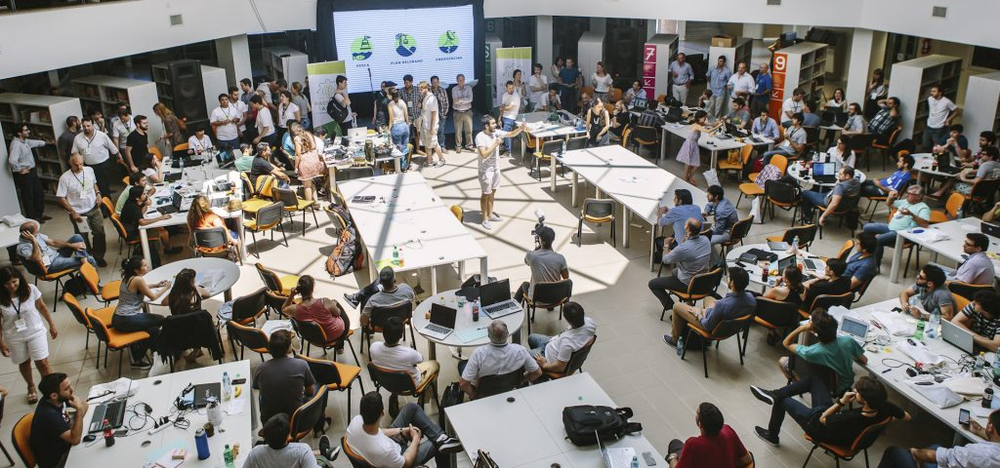

<a name="readme-top"></a>

**Getting Started - Picking a Project and Joining the Developers List**

1. **Choose a Project Repository**: Browse through the list of available project repositories and select the one you wish to work on. Each repository will have a unique identifier or link associated with it.

2. **Clone the Repository**: Use the Git version control system to clone the selected repository to your local machine. If you are not familiar with Git and how to clone a repository, you can find a helpful tutorial [here](git-tutorial-link) to get you started.

3. **Collaborate and Contribute**: Collaborate with your team members by pushing code changes, resolving issues, and adding new features to the repository. Communicate effectively with your team to coordinate efforts and ensure a smooth collaboration process.

4. **Join the Developers List**: To foster a sense of community and to recognize the contributions of each participant, we encourage you to include your details in the Developers List located in the repository. Here's how you can do it:

   a. In the repository's root directory, navigate to the "Developers" or "Contributors" folder.

   b. Open the "developers_list.md" file.

   c. Add your name, GitHub username, and a brief description (optional) about yourself to the list. You can use the following format:

   ```
   - Name: John Doe
     GitHub: johndoe
     Description: Front-end enthusiast, passionate about UI/UX design.
   ```

   d. Save the changes to the file and commit them to your local repository.

   e. Create a new branch (optional) and push your changes to the remote repository.

   f. Submit a pull request (PR) with your modifications to the main branch of the project repository.

5. **Submission and Evaluation**: Follow the submission guidelines provided in the repository to submit your project once it is completed. The judges will evaluate the projects based on the established criteria and select the winners.

6. **Stay Updated**: Keep an eye on your email inbox and our official communication channels for any updates, announcements, or additional requirements related to the hackathon. It is crucial to stay informed about any changes or instructions throughout the process.

By including their details in the Developers List, participants can showcase their contributions and become an integral part of the hackathon's collaborative community. This initiative aims to recognize and celebrate each participant's involvement and foster a sense of camaraderie among all contributors. Happy hacking!

If you have any questions or encounter any issues during the registration process, please reach out to our support team at [support-email@example.com](mailto:support-email@example.com).

We look forward to your participation in the hackathon and seeing your contributions on GitHub! Good luck!

1. Category: Mobile App
   - Idea: Mobile Attendance System Project
     Link: [Checkpoint-App](https://github.com/genus-sc/Checkpoint-App)

2. Category: Backend Development
   - Idea: Intelligent Chatbot with Natural Language Processing
     Link: [Intelligent Chatbot with NLP](https://github.com/intelligent-chatbot)
